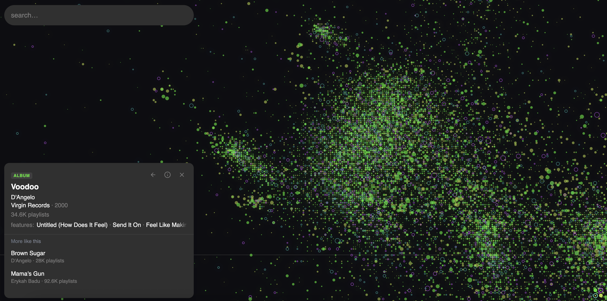
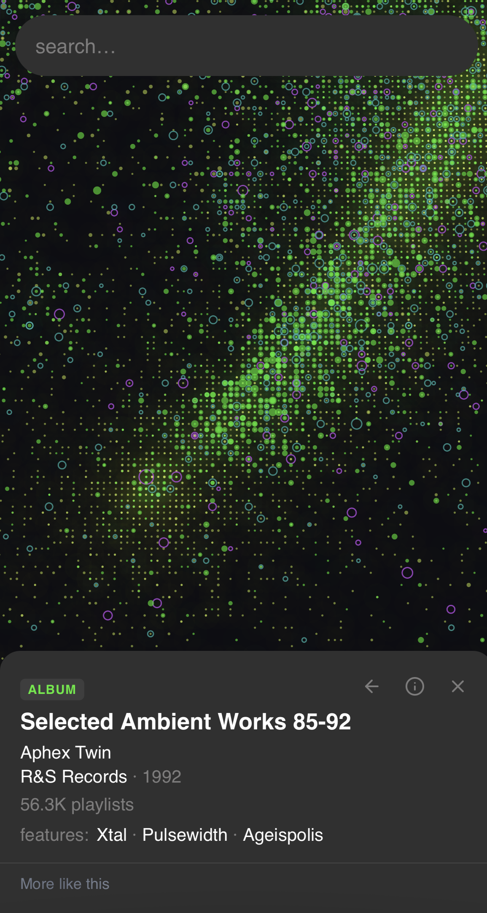

# Toposonico

This monorepo contains all code used for [toposonico.com](https://toposonico.com), a navigable map and recommender for 17M discographic entities across music tracks, artists, albums and labels. 
The project is structured in three main sections:

* `ml` contains everything needed to train the recommender model, export its embeddings and UMAP representation, and to build lookup tables.
* `db` implements a pipeline transforming the previous data products into a proper database and a collection of GeoJSON files.
* `web` is itself split into multiple components: a TS-React frontend living in `frontend`, a Python FastAPI backend living in `backend`, and a Martin tile server living in `tileserver`.

Each of these projects hosts a README describing in more detail each component usage and goal. 

## Screenshots

## How it works

Toposonico is built around a skipgram [word2vec](https://en.wikipedia.org/wiki/Word2vec) model trained over ~7B playlists.
Tracks are embedded in a 128d space. The 2D map was built with [UMAP](https://umap-learn.readthedocs.io/en/latest/how_umap_works.html).
A track is always produced by an artist, for an album and a label. Hierarchies like this were used to infer embeddings for artists, albums and labels, marginalizing over the track manifold.

The model was trained in the cloud with a NVIDIA A100. UMAP was trained there too, leveraging the fast [RAPIDS CuML](https://developer.nvidia.com/blog/even-faster-and-more-scalable-umap-on-the-gpu-with-rapids-cuml/) implementation.
Indexes were built and tuned with [FAISS](https://github.com/facebookresearch/faiss).
The frontend uses [MapLibre GL JS](https://maplibre.org/maplibre-gl-js/docs/). The slippy map tiles were built with [tippecanoe](https://github.com/mapbox/tippecanoe). 

## Why I made this

I like listening to music but found the standard item-list UX of modern recommender systems limiting. 
They are low density. Spatial data can pack much more information within the same space.

Two things influenced me.
The first is a decade-old idea: human navigation and exploration skills work in information spaces too.
The second was an experience: crate-digging. I used to visit records fairs. 
They were messy but I always ended up finding something cool there, and discovering new music I hardly would have found otherwise.
To find a new record you didn't sit down and listen to tens of records in a row, selected based on a supposed model of your personality. 
You wandered around, speaking with dealers and looking through the crates they brought with them.
There were huge stalls and there were small ones. Some were filled with crap, some were gold mines. Finding oddities was very easy.
The crates often leaned on some genre more than another, reflecting the dealer history and taste.
I wanted to make something that felt more like that.
